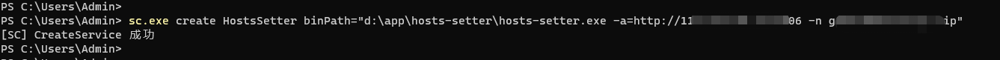
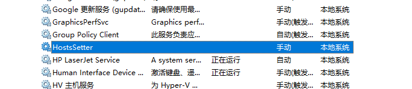
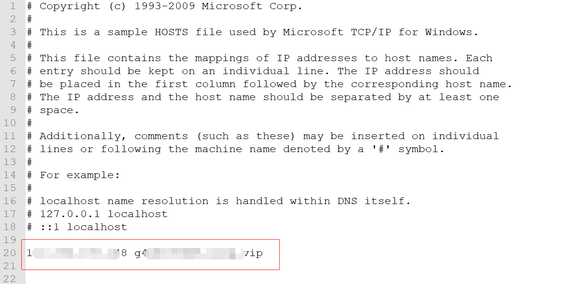
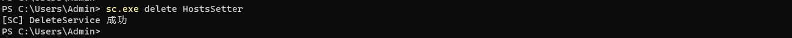

# hosts-setter

```
> hosts-setter.exe -h
定时更新本地的 hosts 文件，实现自定义域名的访问

用法：
注册到 windows 服务: sc.exe create HostsSetter binPath={path-to-this-project}/hosts-setter.exe -a={http://curl-router-host:port} -n={hostname}

-a 指定curl-router-host的地址
-n 指定要更新的域名/主机
-i 指定更新间隔，单位：秒

Usage:
  hosts-setter [flags]

Flags:
  -a, --address string    curl-router 的地址
  -h, --help              help for hosts-setter
  -n, --hostname string   hostname
  -i, --interval int      更新间隔，单位：秒 (default 3600)

```

## build

windows:

```bash
go build -o dist/windows/hosts-setter.exe
```

## use

首先需要在一个具有公网ip的主机上运行 [curl-router](https://github.com/zhizuqiu/curl-router)

1.单独运行

```
hosts-setter.exe -a={http://curl-router-host:port} -n={hostname}
```

2.或注册到 windows 服务

```
sc.exe create HostsSetter binPath={path-to-this-project}/hosts-setter.exe -a={http://curl-router-host:port} -n={hostname}
```



查看已安装的服务，并启动：



默认每个小时更新一下 hosts 文件：



停止、卸载服务：

